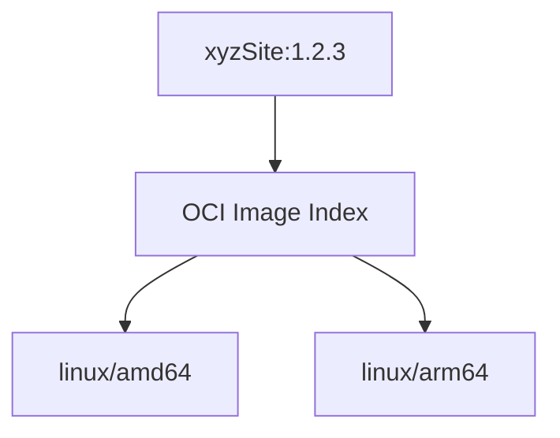
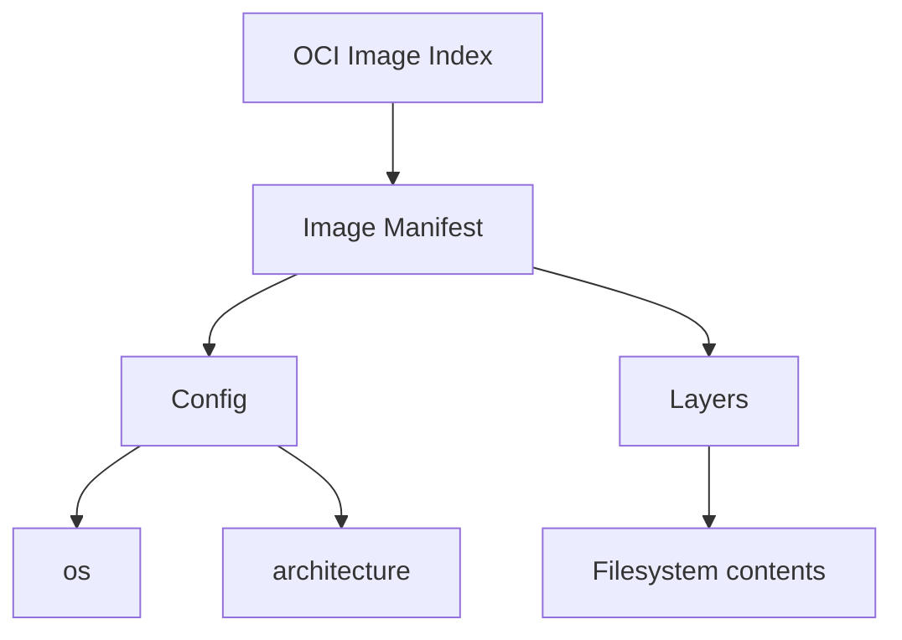
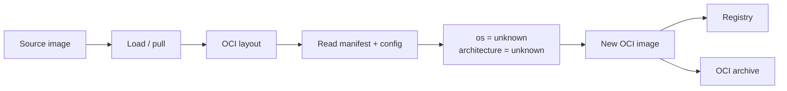

# Image Volume in Practice: os/arch Makes No Sense for Content Images

I recently started looking more seriously at Kubernetes Image Volumes.

The idea is pretty straightforward: instead of baking some files into your application image, you can put those files into an OCI image and mount that image into a Pod as a volume.

Kubernetes introduced Image Volumes as an alpha feature in 1.31, moved them to beta in 1.33, and they became stable in Kubernetes 1.36. By now, the feature is mature enough that we can actually build around it. 

I think this is a really useful feature, especially when you have a large piece of data that you don't want tied to the lifecycle of the container that consumes it.

The obvious example is a huge AI model: ```inference runtime``` + ```100 GB model```. there is no good reason to rebuild the inference runtime every time the model changes, lots of image cache wasted.

But the use case I'm interested in is a little more generic: **separating runtime images from application content**, a problem that developers may also run into.

For example:

- Nginx + HTML/CSS/JS
- Java + JAR
- Node.js + .js / .min.js
- python + .py
- ...

This sounds simple, it also exposed a surprisingly annoying problem.

## The model I wanted

Let's take a simple Nginx website, the traditional Dockerfile is something like:

```dockerfile
FROM nginx:latest

COPY ./site /usr/share/nginx/html
```

It works, but now the Nginx runtime and the website are one image.
- If Nginx has a security update, I rebuild the image.
- If the website changes, I rebuild the image.

Neither of those things really has anything to do with the other, what I wanted instead was something like:

```text
runtimeImage: nginx:latest
siteContentImage:  xyzSite:x.y.z
```

The Pod would run Nginx and mount `xyzSite:x.y.z` as an Image Volume, that gives the two images independent lifecycles.

Nginx can keep following the latest patched release, so I don't have to worry about rebuilding the website just because a CVE was fixed.

The website can be released whenever the business needs it, that's the part of Image Volumes that got me interested.


# Then I tried it.

There are three steps where the architecture issue can show up: build, publish, and deploy.

## Build

The first problem is already a little weird, When I build an OCI image, I have to give it a platform, something like:

```text
linux/amd64
linux/arm64
```

If I don't explicitly choose one, my **build environment chooses the default**, mostly likely the os/arch on build machine. 

That's perfectly reasonable for a normal container image, The image contains a program, and the program has to run somewhere.

But my content image doesn't contain a program that the node is supposed to execute.

It contains HTML, still, the image gets an architecture.

## Publish

If you already have a proper multi-architecture image manifest, you may never notice this problem, you can publish:



and Kubernetes will select the appropriate image for the node, that works. but now I have two copies of the same website.

```text
amd64 → HTML / CSS / JS / images
arm64 → HTML / CSS / JS / images
```

If I support four architectures, I potentially have four copies.
- For a 5 MB website, who cares.
- For a 100 GB AI model, I definitely care.

More importantly, the website itself hasn't changed between those images. Only the platform metadata changed.

## Deploy

This is where I actually ran into the problem, my Kubernetes cluster isn't necessarily one architecture.

my content image was default to linux/amd64, and my linux/arm64 node won't mount it, give me ImagePullBackOff, I totally understand it.

but also I know this doesn't make sense, all I ask is for it to mount a directory containing:

```text
index.html
app.js
styles.css
images/
```

I know it should work on both amd64, arm64 nodes, but kubelet/containerd cares, it did image metadata check.


# The problem

At this point there are basically two choices.

### Build multi-arch content images

This solves the deployment problem, But I'm storing the same content multiple times.

```text
xyzSite:1.2.3

    amd64 → same content
    arm64 → same content
    arm/v7 → same content
    ...
```

If there are `N` architectures, I potentially pay for `N` copies of the content, That's particularly unattractive for large data.

### Pick one architecture

This is what most people probably do without thinking about it.

If everything runs on amd64, build amd64 and move on.

It works until the day you add an ARM node.

Then the exact same content that worked yesterday suddenly can't be mounted on the new node.

So either I waste storage making copies of data that isn't actually different, or I make the content image architecture-specific and accept that I'll eventually hit the problem again.

Neither felt right.

# Looking at the OCI image

The good thing is that the architecture information isn't part of the actual filesystem.

An OCI image is roughly (you can untar any container image, and checkout yourself):



The config contains metadata such as:

```json
{
  "architecture": "amd64",
  "os": "linux"
}
```

per oci spec https://github.com/opencontainers/image-spec/blob/main/config.md#properties , they have to be valid [GOOS/GOARCH](https://go.dev/doc/install/source#environment), I don't see any valid option to express platform neutral image.

## `unknown/unknown`?

I don't remember where I get unknown from, but I tried update config to:

```json
{
  "architecture": "unknown",
  "os": "unknown"
}
```

re-pack and import, and test, it works, now this image load as data volume on both linux/amd64, and linux/arm64. 

one thing I have to call out, Docker chokes on it it won't load image with os/arch=unknown/unknown.

I don't care about docker, I am trying to solve my use case on **Kubernetes Image Volumes.**

# Building the converter

Doing this manually is possible, but it's not something I want to put into every CI pipeline.

So I built a small Go utility called `image-volume-converter`, at https://github.com/kubehub-io/image-volume,  the basic workflow is:



The interesting part is actually very small:

```go
img, source, err := loadImage(ctx, srcRef, platform, auth)

archivePath := filepath.Join(workDir, "docs.tar")
ociDir := filepath.Join(workDir, "docs-oci")

exportOCILayout(workDir, archivePath, ociDir, img)

lp, err := layout.FromPath(ociDir)
idx, err := lp.ImageIndex()

manifestImg, err := idx.Image(manifestDesc.Digest)
cfg, err := manifestImg.ConfigFile()

cfg.Architecture = "unknown"
cfg.OS = "unknown"

noArch, err := mutate.ConfigFile(manifestImg, cfg)

writeLayout(ociNewDir, noArch)
```

The important thing is what it **doesn't** do.
- It doesn't rebuild the application.
- It doesn't rebuild the filesystem layers.
- It doesn't build separate ARM and x86 versions.
- It takes an existing image and changes the metadata describing it.

All it does is change OS/ARCH=unknown/unknown, that's it.

# GitHub Actions

I also wrapped the converter as a [GitHub Action](https://github.com/marketplace/actions/image-volume-converter-for-kubernetes) so this can become part of a normal build pipeline.

For example:

```yaml
- name: Build image
  uses: docker/build-push-action@v4
  with:
    context: .
    file: ./Dockerfile
    load: true
    tags: ghcr.io/${{ github.repository }}:main-latest

- name: Create no-arch content image
  uses: kubehub-io/image-volume
  with:
    imageTag: ghcr.io/${{ github.repository }}:main-latest
    outputImageTag: ghcr.io/${{ github.repository }}:main-noarch
```

Or export it as an OCI archive:

```yaml
- name: Export OCI archive
  uses: kubehub-io/image-volume
  with:
    imageTag: ghcr.io/${{ github.repository }}:main-latest
    publishTo: OCIArchive:/tmp/site-no-arch.tar
```

There is one limitation worth calling out.

**SBOMs, provenance, and attestations are currently ignored by the converter.**, I am not bothered by it, but I will accept PR to fix it.

# We solved it, You can now use it.

here is example of how this works in pod spec.

```yaml
      containers:
      - name: staticweb
        image: nginx:alpine
        volumeMounts:
        - name: site-content
          mountPath: /usr/share/nginx/html
          subPath: site
          readOnly: true
      volumes:
      - name: site-content
        image:
          reference: mycr.io/myimage:mytag
          pullPolicy: IfNotPresent
```

elegant, low-maintenance, no worry on imagePullBackoff.

If you find this doc from same issue, this is your solution https://github.com/kubehub-io/image-volume , I hope it saves your couple hours of time.