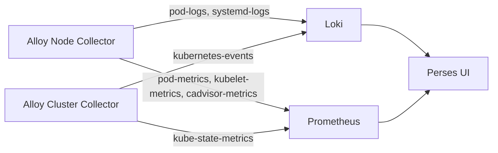

Kubehub includes a built-in monitoring stack so you can see what's happening inside your cluster — logs, metrics, and Kubernetes events — without setting anything up yourself.

## Enable monitoring

1. In the Kubehub portal, open your cluster.
2. Click **Settings**.
3. Go to the **Monitoring** tab.
4. Turn on the monitoring checkbox.

That's it. The stack installs automatically.

## What gets installed

When you enable monitoring, Kubehub adds these components to your cluster:

- **metrics-server** — provides basic resource usage data (CPU, memory) for nodes and pods.
- **kube-state-metrics** — exposes Kubernetes object state as metrics (pod status, deployment replicas, etc.).
- **Alloy** — a lightweight collector from Grafana Labs that gathers logs and metrics. It runs in two modes:
  - **Node Collector** — runs on every node, collects node-level and pod-level data.
  - **Cluster Collector** — runs once per cluster, collects cluster-wide data like events and kube-state-metrics.

## What data is collected

### Logs

| Job name | What it collects | How to enable | Collector |
|---|---|---|---|
| `pod-logs` | Application logs from your pods | Annotate your pod with `logging.kubehub.io/enabled: "true"` | Alloy Node Collector |
| `systemd-logs` | System logs from `kubelet` and `containerd` only | Automatic | Alloy Node Collector |
| `kubernetes-events` | Kubernetes event objects (pod scheduling, restarts, etc.) | Automatic | Alloy Cluster Collector |
| `kubernetes-auditlogs` | API server audit logs | Automatic | Kubehub platform |

### Metrics

| Job name | What it collects | How to enable | Collector |
|---|---|---|---|
| `pod-metrics` | Custom metrics from your pods | Annotate your pod with `metrics.kubehub.io/enabled: "true"` | Alloy Node Collector |
| `kubelet-metrics` | Kubelet performance and health data | Automatic | Alloy Node Collector |
| `cadvisor-metrics` | Container-level resource usage (CPU, memory, network) | Automatic | Alloy Node Collector |
| `kube-state-metrics` | Kubernetes object state (deployments, pods, nodes, etc.) | Automatic | Alloy Cluster Collector |

### Enabling pod-level collection

To collect logs or metrics from a specific pod, add the corresponding annotation to your pod spec:

```yaml
apiVersion: v1
kind: Pod
metadata:
  name: my-app
  annotations:
    logging.kubehub.io/enabled: "true"    # for pod logs
    metrics.kubehub.io/enabled: "true"     # for pod metrics
```

You can add one or both annotations depending on what you need.

## Data retention

- **Logs:** retained for 2 days.
- **Metrics:** retained for 3 days.

We may extend these durations in the future.

## Querying your data

Click the **Monitoring** button at the top of the Kubehub portal. It opens [Perses](https://perses.monitoring.kubehub.io), a dashboard UI where you can query and visualize your logs and metrics.

### Why not Grafana?

Grafana is great, but it doesn't support the multi-tenant isolation we need for a hosted platform — every user's data has to be fully separated. Perses gives us that isolation out of the box.

If you want Grafana anyway, you can install your own instance into your cluster. The monitoring data is accessible to any compatible tool running inside the cluster.

## Architecture overview



Alloy Node Collectors run on every node and forward data to Loki (for logs) and Prometheus (for metrics). The Alloy Cluster Collector handles cluster-wide data. Perses connects to both backends to let you query and visualize everything.
